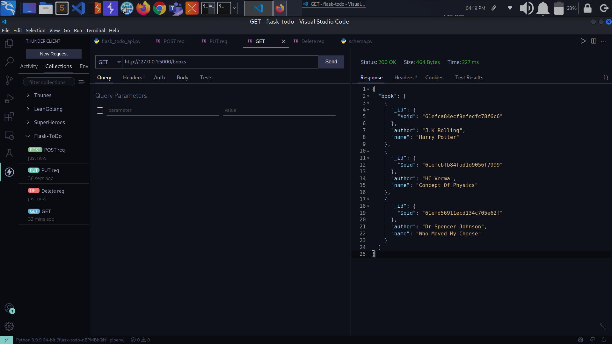
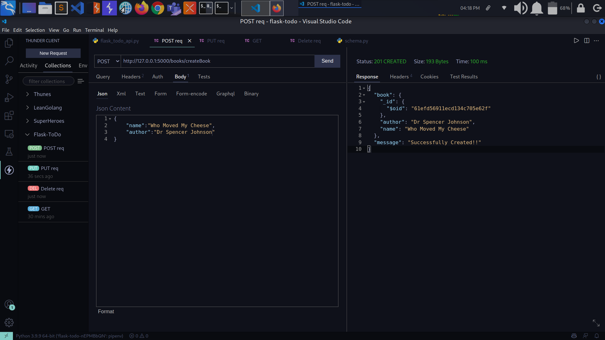
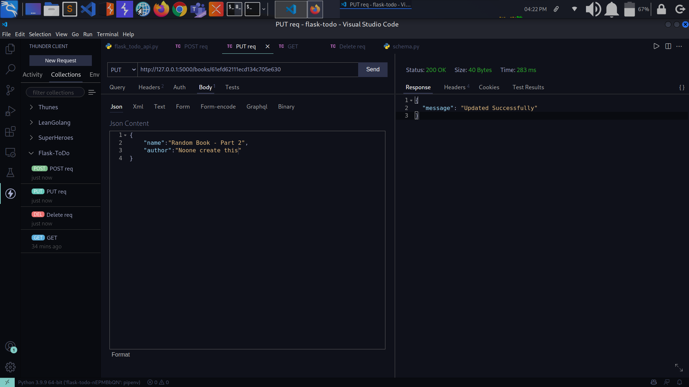
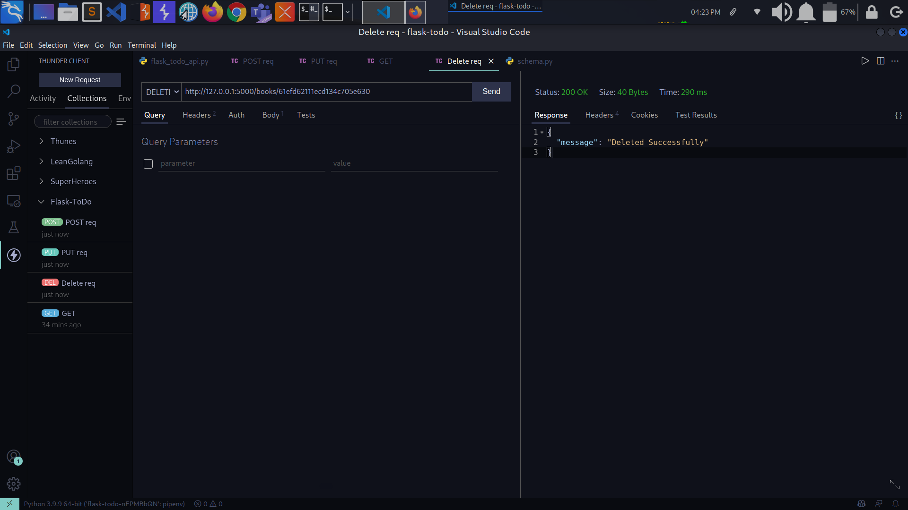

# flask-todo-api

## GET Request

[GET Request](https://drive.google.com/file/d/1JmLq1SOVbalD4adzjc-XW7RzTy5h6L3a/view?usp=sharing)

## POST Request

[POST Request](https://drive.google.com/file/d/1PrIqUGZtteHcJ_fm1EMm38fGlVYWCyPQ/view?usp=sharing)

## PUT Request

[Put Request](https://drive.google.com/file/d/11nM-BgsQiqrtREbANXfo5bSVsqUUrV2_/view?usp=sharing)

## DELETE Request

[DELETE](https://drive.google.com/file/d/11nM-BgsQiqrtREbANXfo5bSVsqUUrV2_/view?usp=sharing)

